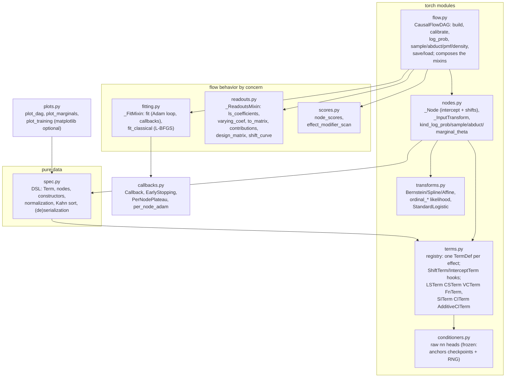
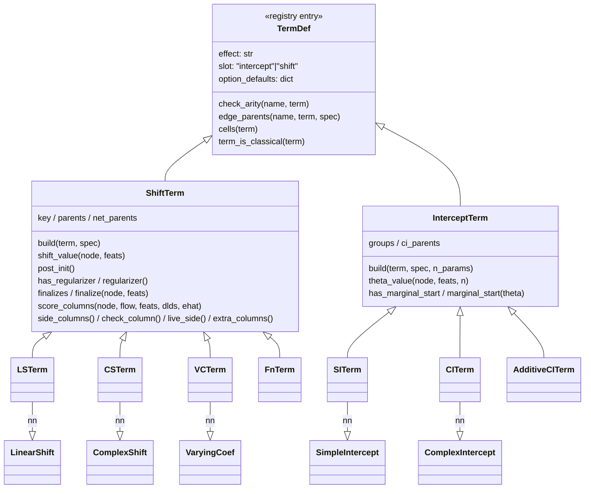
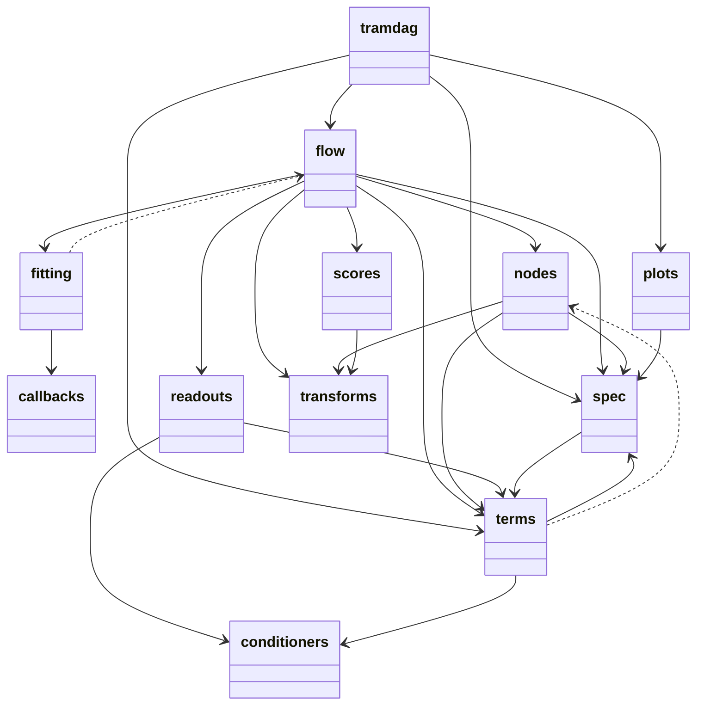
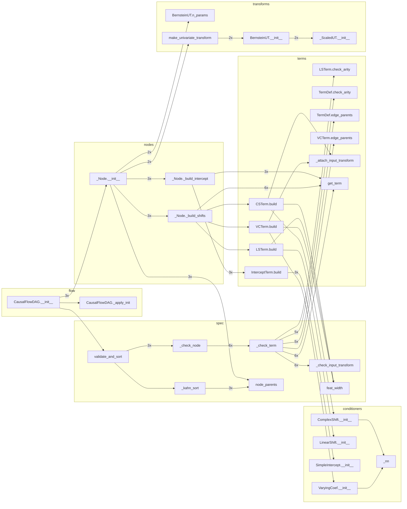
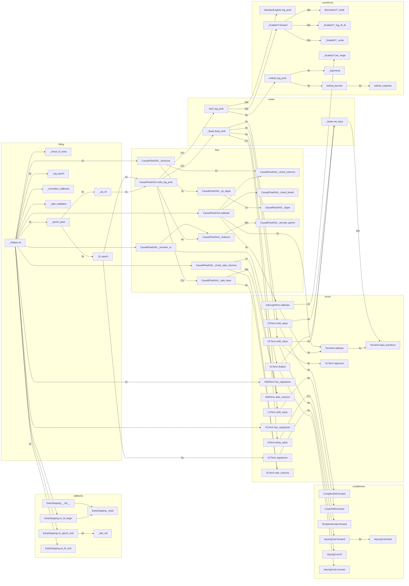

# Architecture

Nine modules, one rule: **term-specific behavior lives on the term's registry
entry; node-kind behavior lives in four adjacent functions; everything else is
framework.** The decisions and their refused alternatives are recorded in
[ADR 001](adr/001-term-owned-architecture.md).

## Module map

(`spec.py` consults the registry lazily, so the data layer stays importable
without torch executing any model code; `fitting.py`/`readouts.py` are
mixins `CausalFlowDAG` composes and import `flow` under `TYPE_CHECKING`
only — the graph is acyclic.)

## The term contract

Built-in terms subclass their conditioners, so state-dict paths
(`nodes.<n>.shifts.<key>.…`) and the seeded RNG stream are those of 0.4.
A custom effect subclasses `ShiftTerm`, sets `effect`/`slot`/
`option_defaults`, implements `build` (which must set `key`/`parents`/`net_parents`) +
`shift_value`, and registers with
`register_term`; the cheap path for a one-off is `fn_shift`.

## Node kinds

Two kinds (continuous, ordinal) stay an if/else — in ONE place:
`kind_log_prob` / `kind_sample` / `kind_abduct` / `kind_marginal_theta`,
adjacent in nodes.py. A third kind is the trigger for a protocol, not before.

## Guards that pin all of this

- `tests/tools/statedict_smoke.py` — seeded per-DGP state dicts, bit-compared.
- The inline DGP truths (`tests/conftest.py`) and 45+ regex-pinned refusals.
- `experiments/*/ground_truth/*.json` — ten CI-checked replications with
  wall-time tripwires; centers move only with a documented reason.

<!-- AUTOGEN:diagrams (tools/gen_diagrams.py) — do not edit by hand -->
## Generated views

Regenerate with ``uv run python tools/gen_diagrams.py`` — the package and
class UML come from pyreverse (classes: names and inheritance only), the
call graphs from a profile trace of one flow construction and one
three-epoch ``fit`` on a 3-node SI/LS/CS/VC spec (tramdag-internal edges
only; ``3x`` = once per node).

### Package UML (pyreverse)

### Class UML (pyreverse)

The built-in terms are conditioners with a term-hook mixin: each concrete
term class inherits its network from ``conditioners`` and its contract
from ``ShiftTerm``/``InterceptTerm``.

```mermaid
classDiagram
  class AdditiveCITerm {
  }
  class AffineUT {
  }
  class BernsteinUT {
  }
  class CITerm {
  }
  class CSTerm {
  }
  class Callback {
  }
  class CausalFlowDAG {
  }
  class ComplexIntercept {
  }
  class ComplexShift {
  }
  class ContinuousNode {
  }
  class EarlyStopping {
  }
  class FnTerm {
  }
  class InterceptDef {
  }
  class InterceptTerm {
  }
  class LSTerm {
  }
  class LinearShift {
  }
  class OrdinalNode {
  }
  class PerNodePlateau {
  }
  class SITerm {
  }
  class ShiftTerm {
  }
  class SimpleIntercept {
  }
  class SplineUT {
  }
  class StandardLogistic {
  }
  class Term {
  }
  class TermDef {
  }
  class VCTerm {
  }
  class VaryingCoef {
  }
  class _FitMixin {
  }
  class _FnCallback {
  }
  class _InputTransform {
  }
  class _Node {
  }
  class _ReadoutsMixin {
  }
  class _ScaledUT {
  }
  EarlyStopping --|> Callback
  PerNodePlateau --|> Callback
  _FnCallback --|> Callback
  CausalFlowDAG --|> _FitMixin
  CausalFlowDAG --|> _ReadoutsMixin
  AdditiveCITerm --|> InterceptTerm
  CITerm --|> ComplexIntercept
  CITerm --|> InterceptTerm
  CSTerm --|> ComplexShift
  CSTerm --|> ShiftTerm
  FnTerm --|> ShiftTerm
  InterceptDef --|> InterceptTerm
  InterceptTerm --|> TermDef
  LSTerm --|> LinearShift
  LSTerm --|> ShiftTerm
  SITerm --|> SimpleIntercept
  SITerm --|> InterceptTerm
  ShiftTerm --|> TermDef
  VCTerm --|> VaryingCoef
  VCTerm --|> ShiftTerm
  AffineUT --|> _ScaledUT
  BernsteinUT --|> _ScaledUT
  SplineUT --|> _ScaledUT
```

### Call graph — flow construction (traced)

### Call graph — one fit (traced)

<!-- AUTOGEN:end -->
